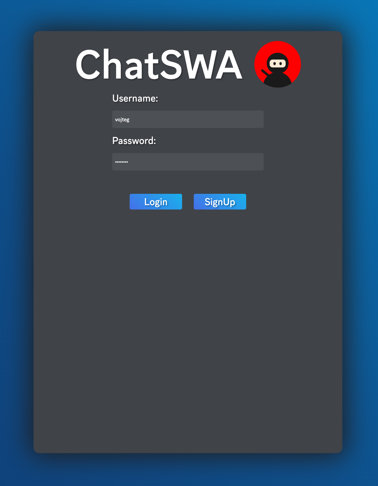
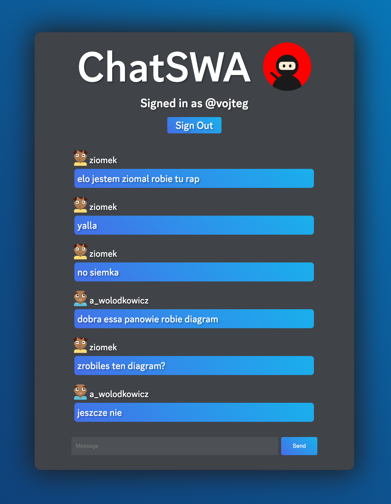

# [ChatSWA](https://chatswa.ninja)

Aplikacja ChatSWA umożliwia użytkownikom komunikację poprzez wysyłanie wiadomości do siebie nawzajem, na wspólnym kanale tekstowym. Aplikacja została zbudowana przy użyciu następujących technologii:

# Użyte technologie

## Linode:

Linode został wykorzystany jako serwer do hostowania bazy danych. Wybór Linode zapewnia niezawodność, skalowalność i wydajność, co jest kluczowe dla przechowywania danych w aplikacji do czatowania.

## PocketBase:

PocketBase został użyty jako baza danych w projekcie. PocketBase zapewnia prosty interfejs do zarządzania danymi i subskrypcji w czasie rzeczywistym, co jest idealne dla aplikacji czatowej, gdzie aktualizacje danych są kluczowe.

## Azure:

Azure został wykorzystany jako serwer do hostowania aplikacji. Azure oferuje niezawodne i skalowalne środowisko uruchomieniowe, które jest idealne dla aplikacji internetowych, takich jak czat, zapewniając wysoką dostępność i wydajność.

## Svelte:

Svelte został użyty jako framework, do budowy interfejsu użytkownika. Svelte oferuje prosty model reaktywności i efektywny sposób renderowania, co przekłada się na szybsze i bardziej płynne doświadczenie użytkownika.

## DiceBear:

DiceBear został użyty do generowania awatarów użytkowników. DiceBear oferuje różnorodne style awatarów, co dodaje wizualnego zróżnicowania do aplikacji czatowej i tworzy przyjemne i unikalne wrażenie dla użytkowników.

## Svelte:

Framework JavaScript do tworzenia interfejsów użytkownika. Svelte został wykorzystany do budowy komponentów interfejsu użytkownika, takich jak page.svelte, Login.svelte i Messages.svelte.

## PocketBase:

Biblioteka JavaScript do integracji z bazą danych w chmurze. PocketBase został użyty do obsługi autoryzacji użytkowników, przechowywania wiadomości i zarządzania kolekcjami.

# Komponenty

## page.svelte

Komponent page.svelte jest odpowiedzialny za renderowanie głównej strony aplikacji. Wyświetla avatar użytkownika, który wysyła wiadomość, oraz zawartość komponentu Login.svelte lub Messages.svelte, w zależności od stanu uwierzytelnienia użytkownika.

## Login.svelte

Komponent Login.svelte obsługuje logowanie i rejestrację użytkownika. Zawiera formularz, w którym użytkownik może wprowadzić nazwę użytkownika i hasło. Komponent korzysta z biblioteki PocketBase do uwierzytelniania użytkowników i przechowywania danych.

## Messages.svelte

Komponent Messages.svelte jest odpowiedzialny za wyświetlanie i wysyłanie wiadomości. Wyświetla listę wiadomości wraz z informacjami o użytkownikach, którzy je wysłali. Komponent używa biblioteki PocketBase do pobierania i dodawania wiadomości, a także do subskrypcji w czasie rzeczywistym, co pozwala na wyświetlanie nowych wiadomości bez konieczności odświeżania strony.

# Style

Aplikacja korzysta z różnych stylów CSS, które zostały zdefiniowane wewnątrz komponentów. Style te są odpowiedzialne za wygląd i układ elementów interfejsu użytkownika, takich jak przyciski, pola tekstowe i listy wiadomości.
